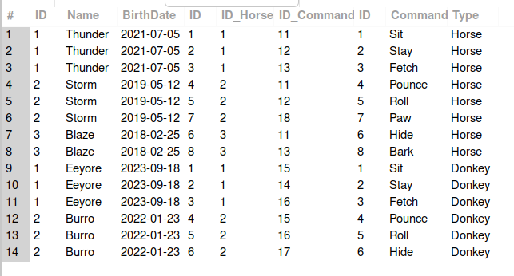
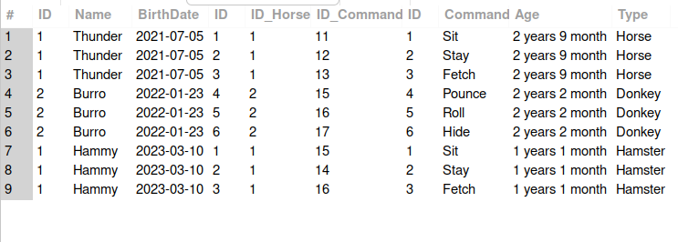
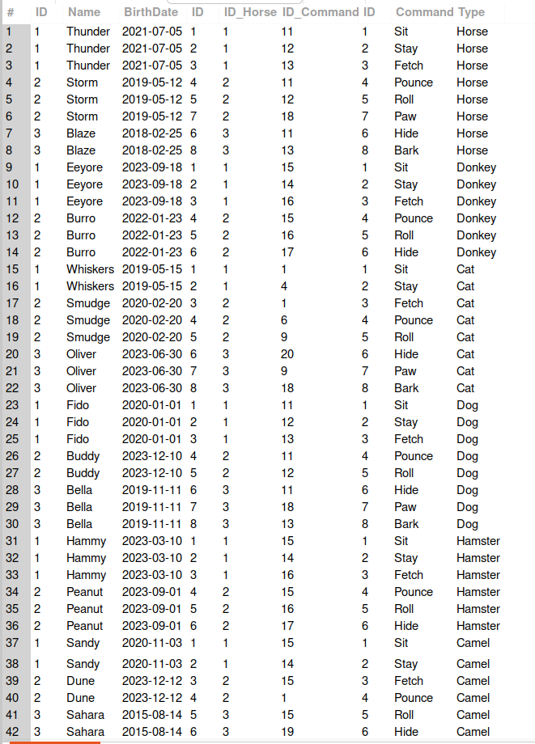

## Итоговая контрольная работа

#### Информация о проекте
Необходимо организовать систему учета для питомника в котором живут
домашние и вьючные животные.
#### Как сдавать проект
Для сдачи проекта необходимо создать отдельный общедоступный
репозиторий(Github, gitlub, или Bitbucket). Разработку вести в этом
репозитории, использовать пул реквесты на изменения. Программа должна
запускаться и работать, ошибок при выполнении программы быть не должно.
Программа, может использоваться в различных системах, поэтому необходимо
разработать класс в виде конструктора
#### Задание
1. Используя команду cat в терминале операционной системы Linux, создать
   два файла Домашние животные (заполнив файл собаками, кошками,
   хомяками) и Вьючные животными заполнив файл Лошадьми, верблюдами и
   ослы), а затем объединить их. Просмотреть содержимое созданного файла.
   Переименовать файл, дав ему новое имя (Друзья человека).
2. Создать директорию, переместить файл туда.


3. Работа с MySQL в Linux. “Установить MySQL на вашу вычислительную машину ”
   - Подключить дополнительный репозиторий MySQL и установить один из пакетов из этого репозитория.
   -  ```wget https://dev.mysql.com/get/mysql-apt-config_0.8.29-1_all.deb ``` скачиваем конфигурацию
   - ```sudo dpkg -i mysql-apt-config_0.8.29-1_all.deb``` установка конфигурации 
репозитория


   - ```sudo apt update``` обновляем параметры систмы


  - ```sudo apt-get install mysql-server``` устанавливаем mysql-server
  - ```systemctl status mysql``` проверяем результат установки


7. Управление deb-пакетами
    - Установить и затем удалить deb-пакет, используя команду `dpkg`.

5. История команд в терминале Ubuntu
    - Сохранить и выложить историю ваших терминальных команд в Ubuntu.
      В формате: Файла с ФИО, датой сдачи, номером группы(или потока)

3. Подключить дополнительный репозиторий MySQL. Установить любой пакет
   из этого репозитория.

- ```sudo apt update``` обновляем параметры систмы
- ```sudo apt install mysql-server``` устанавливаем mysql-server
- ```systemctl status mysql``` проверяем результат установки

4. Установить и удалить deb-пакет с помощью dpkg.
  
 - ```wget https://dev.mysql.com/get/Downloads/Connector-J/mysql-connector-j_8.0.32-1ubuntu22.04_all.deb```
   cкачиваем пакет,
 - ```sudo dpkg - i mysql-connector-j_8.0.32-1ubuntu22.04_all.deb``` установка,
 - ```sudo dpkg -r mysql-connector-j```,
 - ```sudo apt-get autoremove``` удаляем пакет и его зависимости пакеты.

5. Выложить историю команд в терминале ubuntu
   - Сохранить и выложить историю ваших терминальных команд в Ubuntu.
         В формате: Файла с ФИО, датой сдачи, номером группы(или потока)


### Объектно-ориентированное программирование

6. Диаграмма классов
    - Создать диаграмму классов с родительским классом "Животные", и двумя подклассами: "Pets" и "Pack animals".
      В составы классов которых в случае Pets войдут классы: собаки, кошки, хомяки, а в класс Pack animals войдут: Лошади, верблюды и ослы).
      Каждый тип животных будет характеризоваться (например, имена, даты рождения, выполняемые команды и т.д)
      Диаграмму можно нарисовать в любом редакторе, такими как Lucidchart, Draw.io, Microsoft Visio и других.


7. Работа с MySQL (Задача выполняется в случае успешного 
выполнения задачи “Работа с MySQL в Linux. 
“Установить MySQL на вашу машину”
    - 7.1. После создания диаграммы классов в 6 пункте, в 7 пункте база данных "Human Friends" 
   должна быть структурирована в соответствии с этой диаграммой. Например, можно создать таблицы, которые будут соответствовать классам "Pets" и "Pack animals", и в этих таблицах будут поля, которые характеризуют каждый тип животных (например, имена, даты рождения, выполняемые команды и т.д.).
    - 7.2  В ранее подключенном MySQL создать базу данных с названием "Human Friends".
      - Создать таблицы, соответствующие иерархии из вашей диаграммы классов.
      #### *решение с sql кодом [final_work2.sql](final_work2.sql)*
      - Заполнить таблицы данными о животных, их командах и датами рождения.
      - Удалить записи о верблюдах и объединить таблицы лошадей и ослов.
      
      - Создать новую таблицу для животных в возрасте от 1 до 3 лет и вычислить их возраст с точностью до месяца.
      - 
      - Объединить все созданные таблицы в одну, сохраняя информацию о принадлежности к исходным таблицам.
      


8. ООП и Java
    - Создать иерархию классов в Java, который будет повторять 
   диаграмму классов созданную в задаче 6 (Диаграмма классов) .

9. Программа-реестр домашних животных
    - Написать программу на Java, которая будет имитировать реестр домашних животных.
      Должен быть реализован следующий функционал:

   - 9.1. Добавление нового животного
     - Реализовать функциональность для добавления новых животных в реестр.       
        Животное должно определяться в правильный класс (например, "собака", "кошка", "хомяк" и т.д.)

   - 9.2. Список команд животного
     - Вывести список команд, которые может выполнять добавленное животное (например, "сидеть", "лежать").

   - 9.3. Обучение новым командам
     - Добавить возможность обучать животных новым командам.
   
   - 9.4 Вывести список животных по дате рождения

   - 9.5. Навигация по меню
     - Реализовать консольный пользовательский интерфейс с меню для навигации между вышеуказанными функциями.

10. Счетчик животных
    Создать механизм, который позволяет вывести на экран общее количество созданных животных любого типа (Как домашних, так и вьючных), то есть при создании каждого нового животного счетчик увеличивается на “1”. 